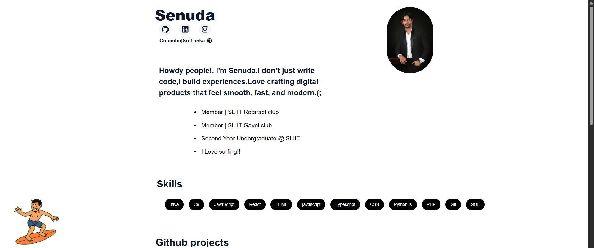
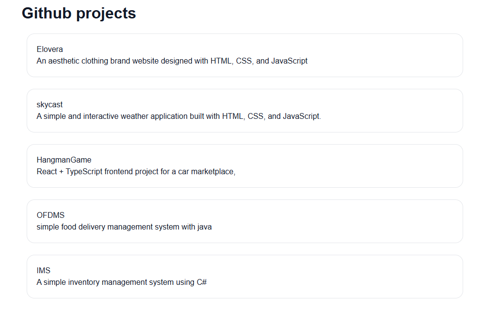

# 🌐 Personal Portfolio

<p align="left">
  
  
  
  
  
</p>

A modern and responsive **developer portfolio** built to showcase my skills, projects, and experience.  
Focused on **clean UI**, **smooth animations**, and **performance**.

---

## 🚀 Live Features

- 🎨 Clean & minimal UI  
- 📱 Fully responsive design  
- 🌙 Dark mode support  
- 🎥 Smooth scroll & intro animations (Framer Motion)  
- ⚡ Fast load times (Next.js + Vercel)  
- 🧩 Modular & reusable components  

---

## 📸 Screenshots





---

## 🔧 Tech Stack

**Frontend**
- Next.js
- React
- Framer Motion
- CSS Modules

**Tools & Deployment**
- Git & GitHub
- Vercel

---

## ▶️ Getting Started

1️⃣ Clone the repository

```bash
git clone https://github.com/your-username/portfolio.git
```


2️⃣ Install dependencies


```bash
npm run dev

```

---

## 🧩 Project Structure

├── app 
├── pages        
├── components         
├── components
├── public            
├── assets
├── styles             
└── README.md

---

## 👤 Author
Senuda


---

## 📄 License

This project is licensed under the MIT License.
